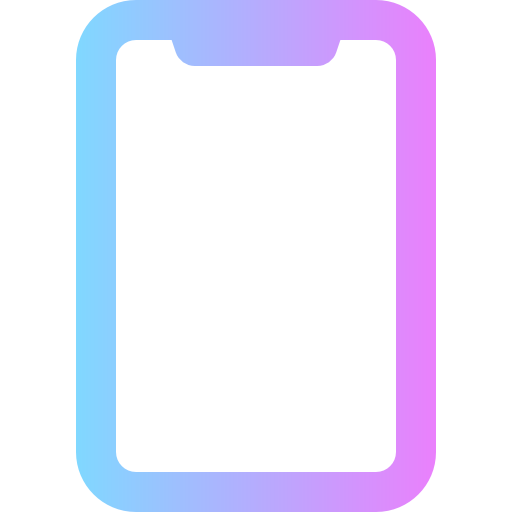

<h1>< Lucas Fabre /></h1>

<left>19 ans  
 20 rue du souvenir 69009 Lyon  
 06 48 61 50 01  
   lucas.fabrelf@orange.fr  
 [L-Fabre](https://github.com/L-Fabre)
 
 
 **
Formations
**

-----------------------------------------------------------------  
2019/2020 1ere année préparatoire développeur full stack   IT Akademy 69002 LYON  

2018/2019  Prépa études scientifiques supérieur  La Salle Croix Rousse 69001 LYON  

2017/2018  1er année BTS opticiens lunetier  Institut Emmanuel d’Alzon 3000 Nimes  

2014/2017  Baccalauréat professionnel Optique Lunetterie mention bien  Institut Emmanuel d’Alzon 30300 Beaucaire  

 

**
Experience professionnelle
**

-----------------------------------------------------------------  
* juillet-août 2019  __Travail saisonier__ employé commercial SuperU 07120 Ruoms
  * mise en rayon du libre service

* De mai à juillet 2018 __Période de formation en milieu professionnel__  
Visio Optique 07200 Aubenas  
  * ventes comprenant le choix de la monture et des verres en fonction des besoins du   client, tiers payant mutuelles, suivi des dossier 

* De mai à avril 2017 __Période de formation en milieu professionnel__   
Visio Optique 07200 Aubenas  
  * accueil et conseil des clients

* De novembre à décembre 2016 __Période de formation en milieu professionnel__  
Visio Optique Cc Leclerc quart Champs, 07200 Saint Etienne de Fontbellon
  * réception, taillages et montage des verres sur les montures  
 

 

**
Languages informatiques
**  

-----------------------------------------------------------------
* HTML    
* CSS   
* JavaScript   
* PHP   

 

**
Centre  d'interets
**  

-----------------------------------------------------------------
* Vélo   
* Running  
* Movie 
* Travel  
 